# Janus : Testing Turquoise Lake (10/5/2019)

## Yaw Control & Thruster Linearization

It was discovered that with wrap angle on it was effectivly impossible to set pid gains that allowed yaw control of the simulated submarine.  To fix this on the car ride to the lake the code was modified to use a non-wrapped yaw state.  This required significant changes to the cusub pose_pid code.  This should be setup as an option.  Additionaly it was noted there is an enormus amount of dead code in the repository which should be removed.

Initaly it was thought that the pid loop might not be working due to the extrem non-linearity of the motor control efforts.  To mitigate this the motor control efforts where linearized in pid_pololu.  This should be setup as a customizable parameter for any given sub.  During sub testing it was found that Janus did not have scipy installed for the 1dinterp, this will need to be installed for thruster linarization to work.

## Lake Test

We arrived at Turqoise Lake, Leadville and headed for the Tabor Campground, but the campground had its gate up.  We circled the lake counter clock wise from there in search of an alternative launch site.  Eventually we arrived at the Abe Lee Fishing Site.  The parking was directly next to the water, the water deepended relativly quickly allowing for ease of launch, and there where only a few other people there leaving ample room to setup.  We did not explore the May Queen camp site but it looked like it might also be a good launch site near the inlet to the lake.  The area near the boat ramps also bears investigating.

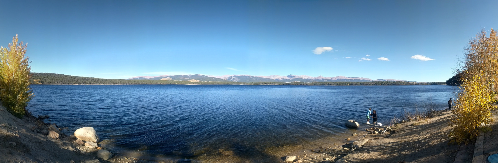

The submarine was pumped down.  The inner surface of the dome fogged as it usually does.  It had the dome removed and defogged, rinsed with lake water, then pumped down again.

Due to a lack of internet access remotes for the cusub and usub_drivers packages where setup using ssh to the hyrokkin laptop.  This allowed pulling the lastest code written in the car.  Unfortunatly it was discovered that scipy was not installed and thruster linearization had to be backed out.  It was decided to back out software to a pre-yaw-pid state for the days testing.

Once everything was up and running on the old software build the janus-hud rqt_image_view was fired up and all the sub parameters showed.  The fatshark googles where connected to the laptop HDMI port and the image_view window moved to that display.  Laura put the sub in the water and I tested it by diving the submarine.

To record the video a Ros Bag recording was attempted on Janus but with less than 1GB of space available on the SD Card it would not bag.  Instead on the laptop a remote bag of the Theora video stream was recorded.

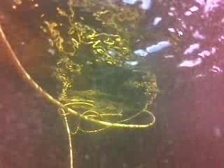
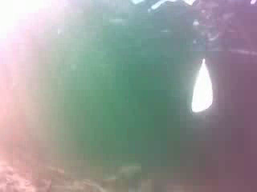
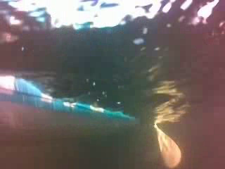
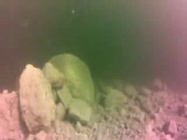
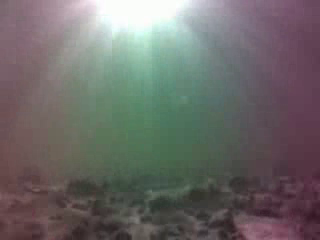

At the surface there was not much to see.  The view seemed to be pitched up a bit and the bottom was not visible.  To deal with this in addition to getting the pitch control working we tilt the camera down 45 degrees.  Most piloting will be done by looking at the floor and most of the items of interest will be at the bottom so a good view of the bottom is critical.  During operation decending to the bottom in a controlled manner was not possible due to the lack of bottom image.  By the time I saw bottom features such as rocks the sub was already bottomed out.  A few interesting rocks where observed.  Immediatly after reaching the bottom a large amount of dust was always thrown into the air effecting visibilty.  This will be mitigated by being able to see the bottom and not bottoming out.  Additionaly the sun reall blew out contrast looking upward.  Very difficult to see anything in frame with sun shining.  Perhaps an upward tilted, and downward tilted camera are each useful.

After driving around for a bit it was observed that the sub was having trouble moving forward and turning left.  Inspection at the surface showed the rear rigth thruster had broken off.  but the sub was still generally pilotable so the mission was continued.

It was possible using the camera view an the hud yaw data to pilot the sub to and from shore.  Following the tether back was the most effective means of navigation.  A strong current pulled the sub east along the shore during operations that was difficult to notice while underwater.  Generally the sub was brought to the surface for to pilot it back up along te shore.

## Post mission

With the sub missing a motor it was decided not to conduct a second test.  On inspection of the damaged motor it was noticed that the sharp edges of the blades where rounded off, the cowling was missing, and there was a large amount of fishing line wrapped around the shaft.  The motor had managed to twist its supply cable quite tightly, likley by the propeller getting stuck on the frame and it wrapping itself up.  Motor did not spin freely and there was a bit of friction turning it but no crunching or grinding from sand.

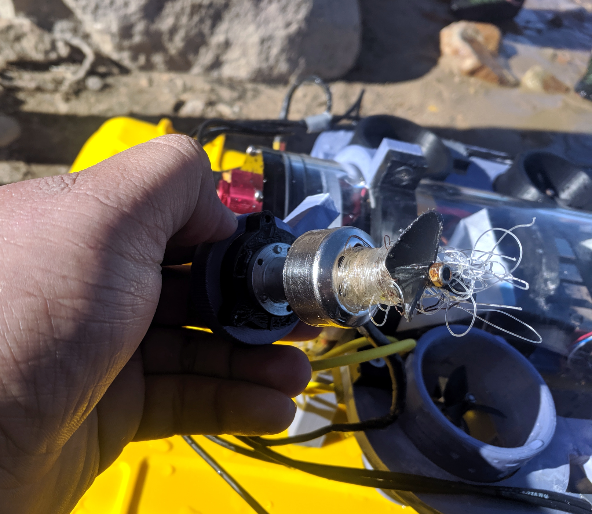

The mission was ended with the battery at about 13.7v under light load.  The battery was warm and sligthly puffy when removed.

The internal temperature never exceded 29 degrees celcius.  The water was very cold around or below 50 degrees fahrenhight.

The submarine was dried and all equipment was stowed and packed up.

## Inspection And Repair

Upon unpacking the submarine at home that night it was noticed that the rear left motor was missing its propeller and was wrapped in what appeard to be somekind of thread.  The Front right motor was wrapped in seaweed.  Below are photographs of the 3 motors with damage.

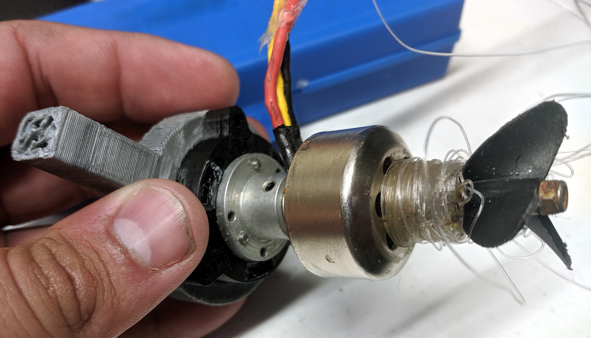

The back right motor had a lot of fishing line wrapped around it.  It had to be cut away with an xacto knife.

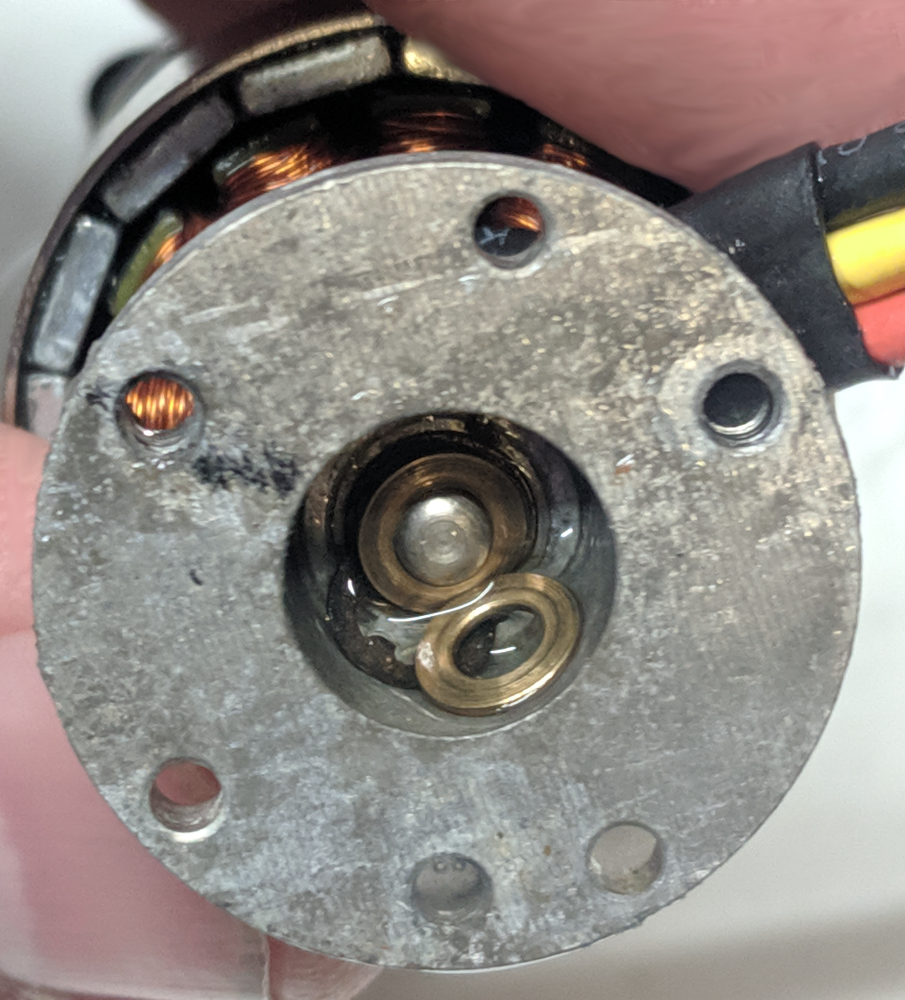

The C-clip holding the shaft on on the rear of the motor had become disconnected.  It was pushed back on after cleanning and repair of the motor but does not have much in the way of retention force.

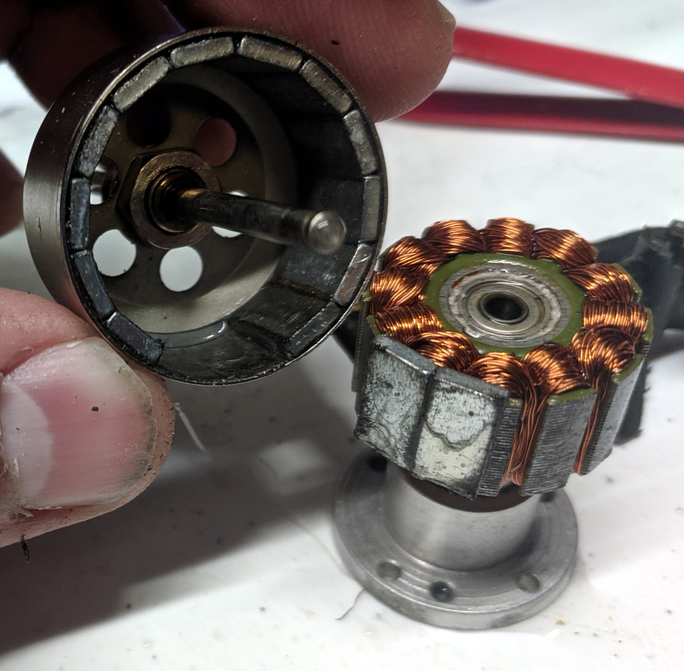

After removing the shaft and rotor of the motor it was observed that 2 of the rotor magnets were left on the stator.  They where super glued back onto the rotor.  The motor was reassembled and appeared to spin freely.  The motor mount was acetone welded back to the frame and a new thruster cowling was printed.

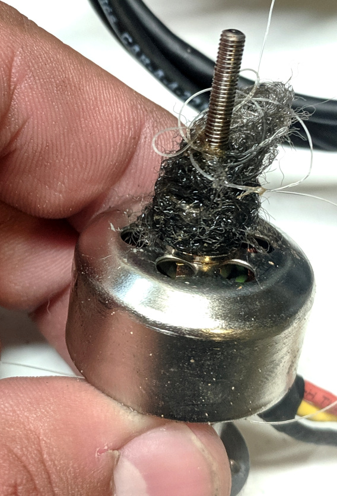

The back left motor was missing its propeller.  The rear lock nut had come off during operation and the propeller fallen off.  Recommend locktite on the propeller nuts in the future.

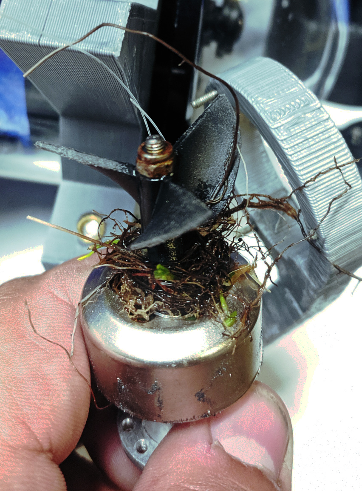

The front right motor was covered in seaweed but this did not appear to affect its operation as it still spun freely other than somewhat obstructing the water flow.

While removing the motors one of the down motors mounts broke where the frame drops to its mount.  It was acetone welded back together.

## TODOs

* Install scipy on Janus
* Reprint sub frame out of solid ABS, print frame in pieces printed oriented for maximum strength and then acetone weld them together.
* Tilt camera down 45°
* Add a light to shiny on bottom on frame next to front motor mount tilted down
* Add ultrasonic bottom sensor and integrate into depth control to prevent bottoming out
* Add foam, move balast, or bias depth motors to get pitch even, or slightly down in water
* Set up full resolution recording on sub with camera while allowing remote video streaming.  Is possible using gstreamer?
* Upgrade nano SD-Card to 32GB or bigger only 1GB remaining on 16GB card currently installed