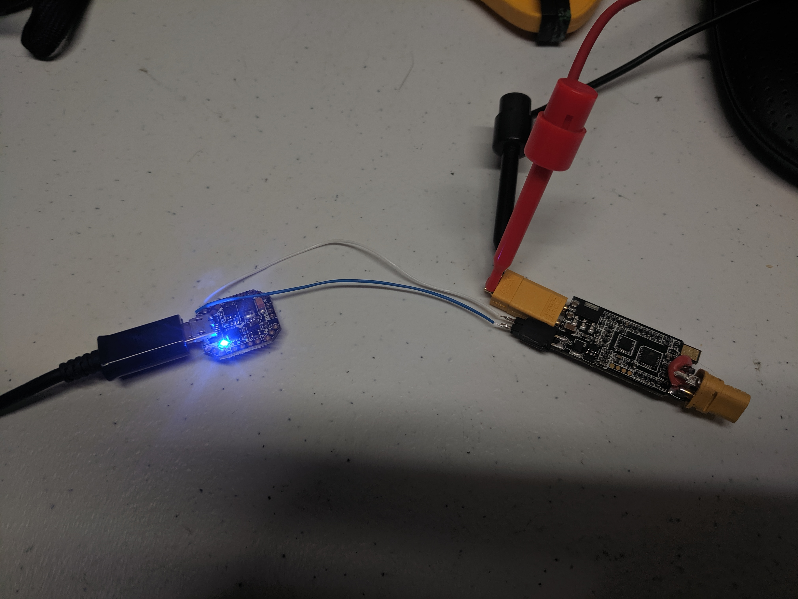
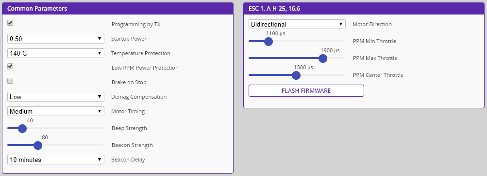
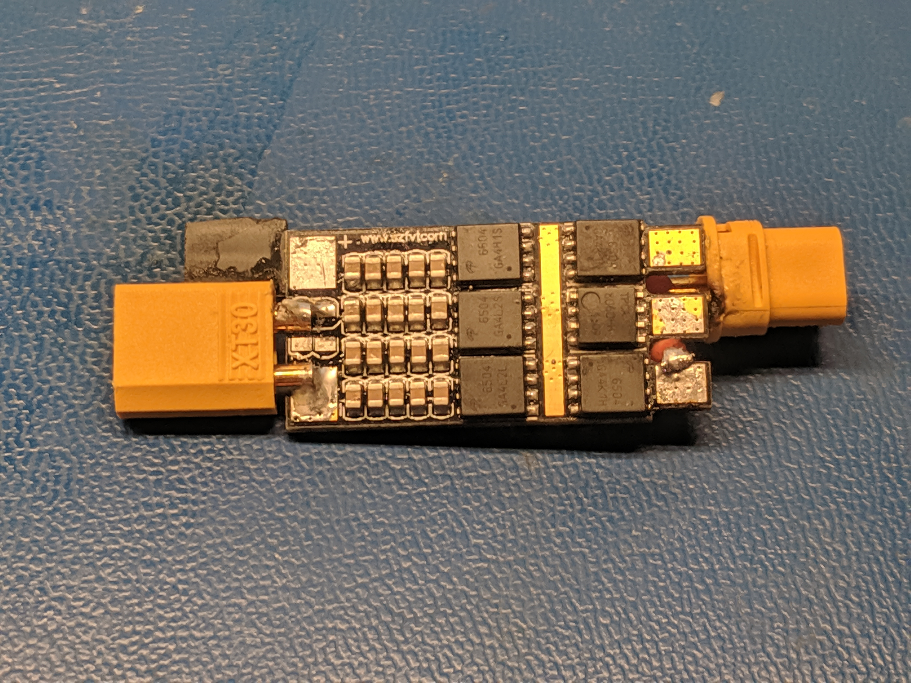
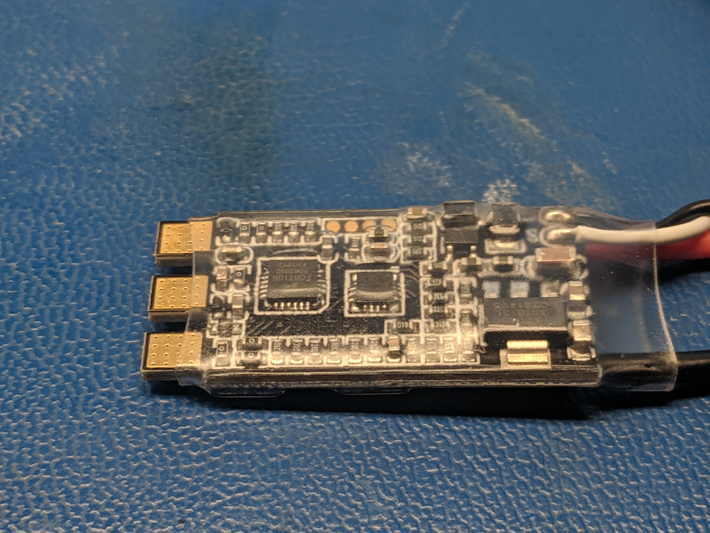
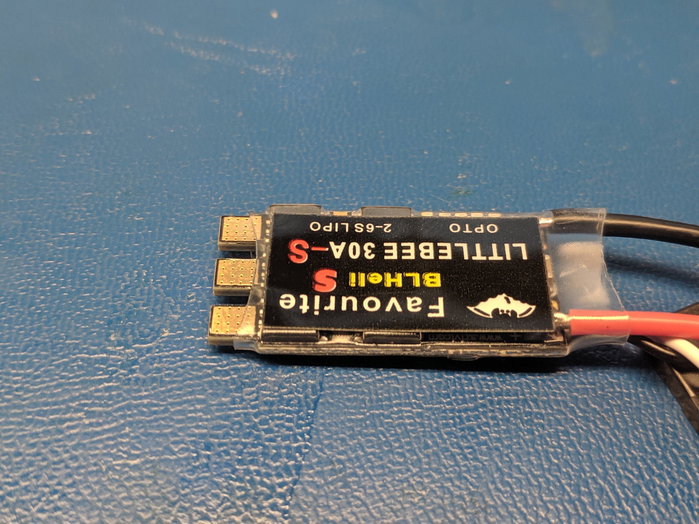
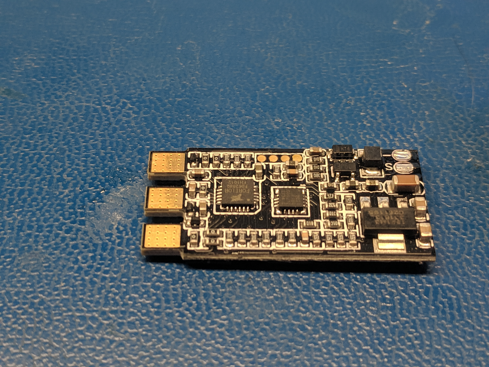
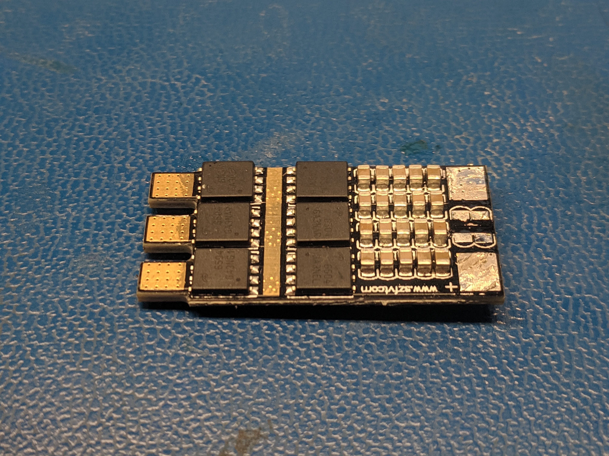
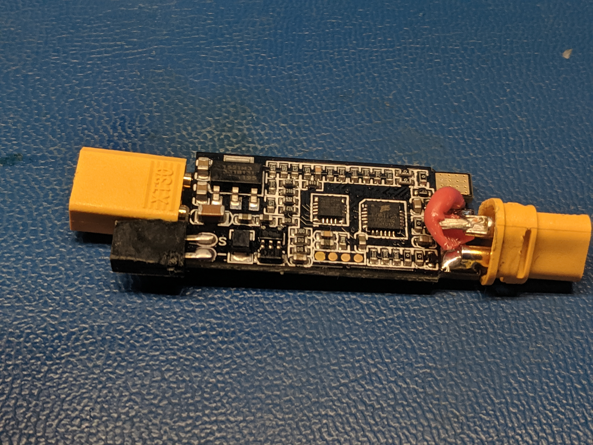
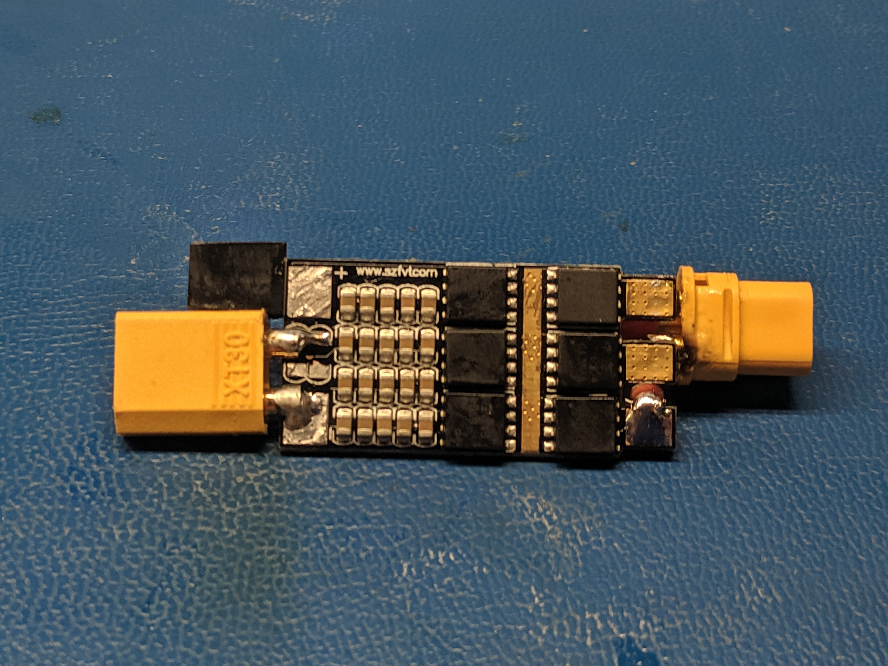
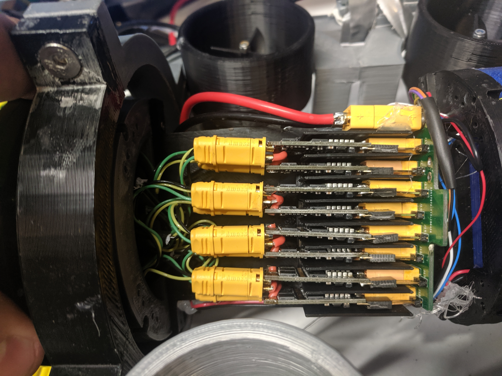

# Janus : ESC Repair (9/16/2019)

ESC was discovered to be defective during inital bench testing.  FET visibly smoked.  Due to a lack of a replacment it was used in inital pool testing and failed completly.

New ESCs were ordered and one was modified to replace the broken ESC.

ESC programming was done with a EMAX Femto F3.

Settings from old ESC where read using BLHeli Configuration and can be seen below.

It was observed that the damaged ESC pulled 200mA of current with no motor connected with a 7.2V input.  Considerably more than a non-damaged ESC which pulls 4mA.

Below we see the old ESC.

|  |  |
|:---:|:---:|
|Top|Bottom|

Below we see the new ESC as delivered.

|  |  |
|:---:|:---:|
|Top|Bottom|

The heatshrink sheath and unneeded wires are removed.

|  |  |
|:---:|:---:|
|Top|Bottom|

The connectors are transfered from the damaged ESC.

|  |  |
|:---:|:---:|
|Top|Bottom|

ESC was installed into Janus.  Medium power was run into system for 1 minute and no escess current or smoke were observed.  ESC drew about 400mA with a PWM input of 1650uS.

## TODOs
* Need to linearize inputs to ESCs to remove dead zones and make control effort linearly proportional to thrust.  We can start with just removing the deadzones as I do not have a way to measure motor thrust.