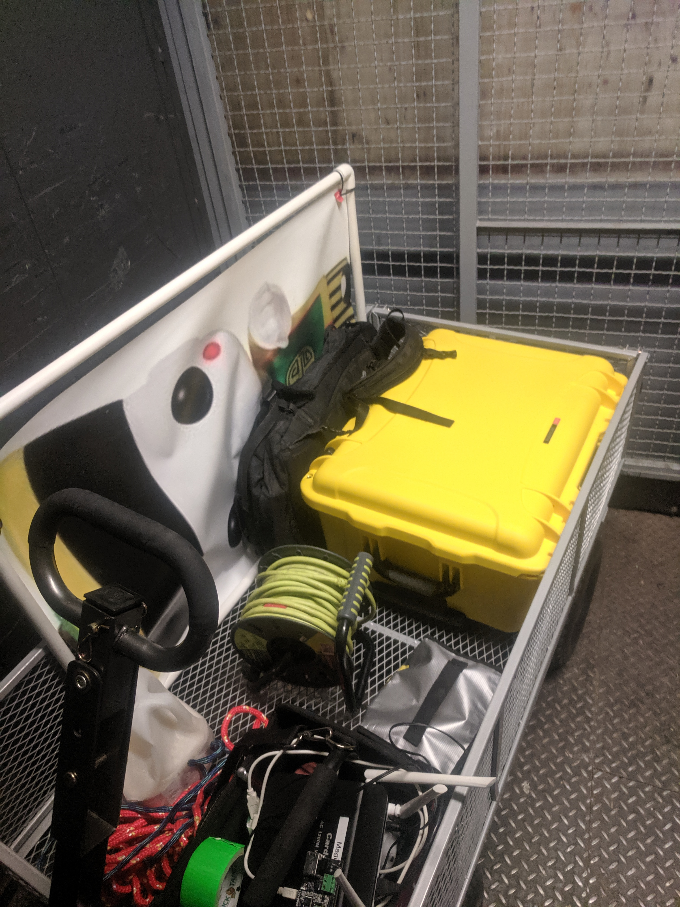
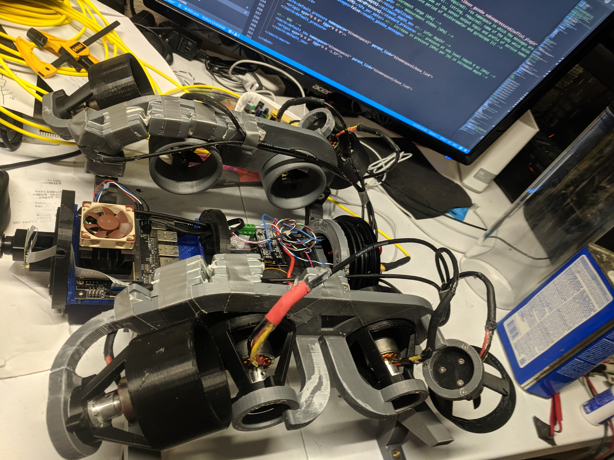
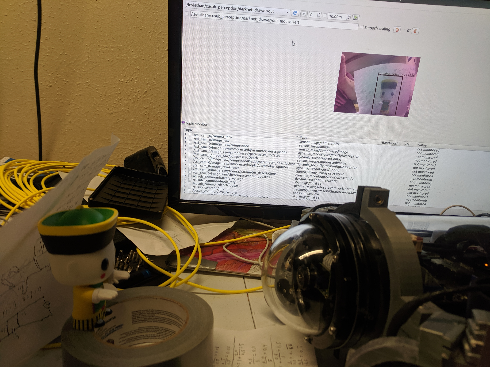
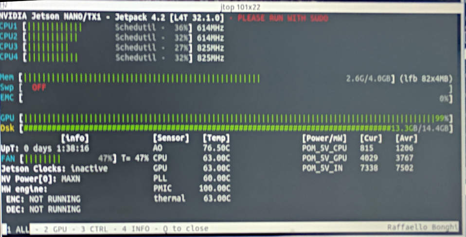

# Janus : Testing Dive Day (9/21/2019)

## Transport

First day with new Nanuk box for transport.  No issues with breaking in trasport.  Case fits well in gorrila cart.

## Divewell Testing

No one was at lab so did not initally bring Leviathan.  Met up with people at the divewell and sent them back to get the Levithan.  Powered up submarine and did initial testing.  Submarine had the tether knotted around the frame to the left of the back so it could not come disconnected.

Video stream started lagging at 640x480 at 10FPS.  Adjusted 320x240 at 10FPS and did not experience issues with lag.  Tested bandwidth with iPerf and got 8 Mbit/s so it is unclear what causes issue as stream bandwidth should be nowhere near that.

During forward driving below the surface had to force pitch command down to stay stait.  This got worse and worse until the tube popped off at the surface.  I suspect that the back of the enclosure was slowly being pushed out of the tube by the air heated by the ESCs which lead to pitching backwards due to the large weight of the rear cap leading to worse pitching.  Redistributing the ballast to be at the bottom of the tube should aid in stability.  Increasing the battery mass and removing some of the ballast should cause a similar improvment.  Shifting the center of mass downard will improve pitch/roll stability while also allowing the drive/strafe motors to fire though the center of the mass.  It will still likley be firing below the center of drag.

The tube popped off and stayed floating at the surface.  The electronics rack and frame sunk to the bottom.  The sub was immediately pulled out using the tether.  The battery was immediately disconnected and the sub was taken outside to dry.  The rest of the diveday was spend working on the Leviathan.

## Repairs

Once back at home the sub was bathed in 99% techinical grade isopropyl alcohol to wash away residual salts from the pool.  It was left on a board preheater set to 90 degrees celcius for about an hour to drive off the alcohol and any residual water.  When power was reapplied a small current was drawn even though the switch was off.  On closer inspection it was determined that water had penetrated the relay.  To clean and drain the relay it was removed from the electronics rack and a hole was drilled in the top.  It was filled with isopropyl alcohol and drained.  Inspection of the solder joints on all the electronics revaled no problems.  Inspection of the camera showed water had penetrated inbetween the IR Filter and the sensor of the raspeberry pi camera.  A spare pi camera v2.1 board was obtained.  The thick foam tape holding on the camera sensor was removed and the camera sensor was glued back down with a dot of super glue the way the bluerobotics version was.  The lens was transfered to the new camera and focused.  Image was clear and camera functioned correctly.  The old camera was washed in isopropyl alcohol and left to dry will be tested once no liquid is observed between the IR filter and the sensor.

There were several breaks in the frame.  The screw hole in the frame clamp with the counter sink for the screw head was broken during frame disassembly.  The weld point between the front motor mount and the middle frame section was broken.  The pieces where acetone welded back together.  Additionaly during cleaning the Nano tray broke where it was mounted to the circular sections of the electornics rack.  It broke along the screw holes connecting it to the rings.  This section was disassembled and welded back together with acetone.

During testing the I2C connector was plugged backwards into the Jetson Nano.  This prevented the Nano from booting but caused no permanent damage to any components.

You can see the repaired frame and rack below while the two halves where still seperated.

To test pulling a small vaccum as a potential fix to the enclosure popping open to heating a vaccum of 10-15 inHg was pulled and the vent plug was quickly inserted after removing the vaccum.  IMU Temperature monitoring was added to the usub_driver so we could have another datapoint for temperature ontop of the GPU temperature.  There was some concern that removing air from the tube would reduce thermal convection and cause overheating in the tube.  The first test was to see how much heat was generated by the ESCs.  With the ESCs running at 40% speed the temperature reached 30 degrees celcius after about 30 minutes of running.  This was not loaded by water and the battery was not showing significant voltage drop so this did not appear to accuratly simulate pool heating.  To generate more heat darknet was setup and run to fully utilize the GPU.

With darknet running the temperature on the IMU got as high as 48 degrees celcius and appeared to be continuing to rise as the test ended.  The test ended as the battery reached 14V.  The top of the tube was noticably warm to the touch.  GPU & CPU temperatures on the Nano reached as high as 70 degrees.  This was running for about 30 minutes so there does not appear to be any severe thermal concern.  JTOP was used to monitor the nano temps as it is significantly easier to read than tegrastats.

After reaching max temperature removal of the cap was attempted.  The vaccum held it tightly.

There was noticable swelling of the battery after it was removed.  It was quite warm.  After cooling there was no noticable swelling and the battery appeared to be undamaged from operating in the 48 degree ambient temperature.  The battery rechared with no issues.

After running hot and removing the dome it was observed that isopropyl alcohol from the wash had been evaporated and recondensed on the interior of the dome.  It was cleaned and defogged.  Its believed that the dome needs the cleaning scrub done before defogging for the defog to be effective.

## TODOs
* Lower sub Center-of-Mass for more stable operation
* Do defog scrub cleaning on dome