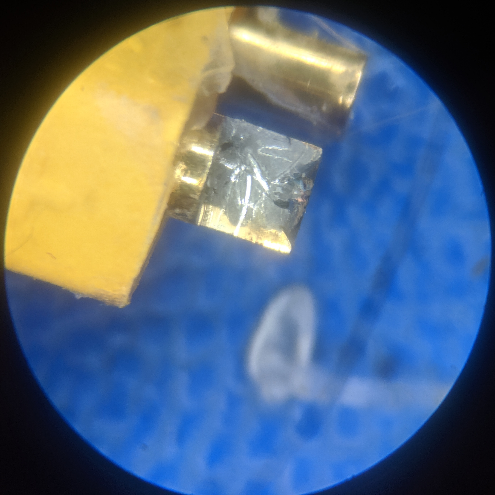
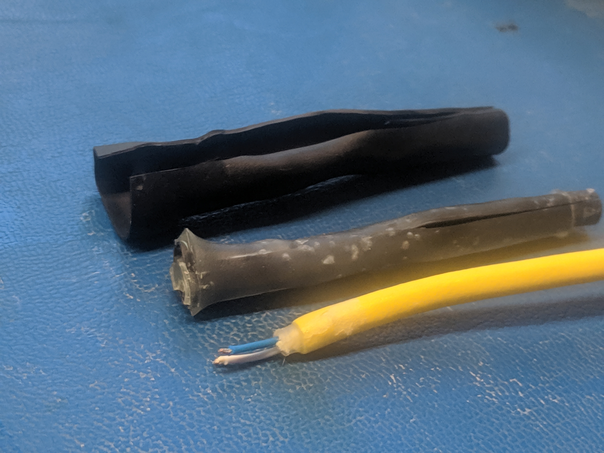
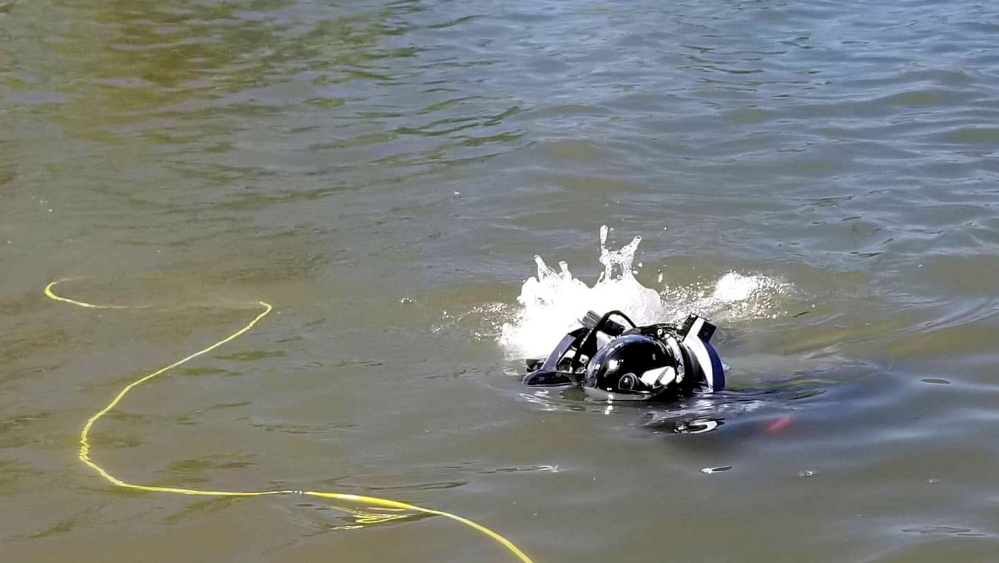
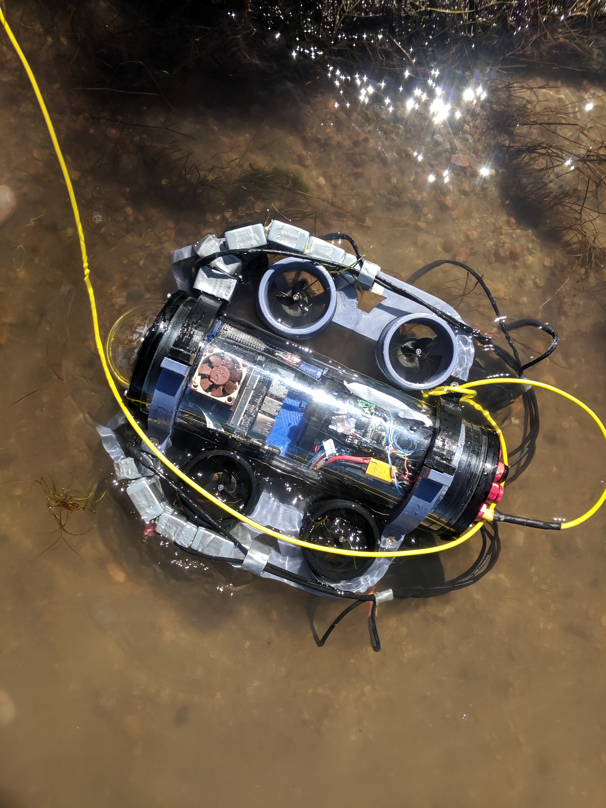
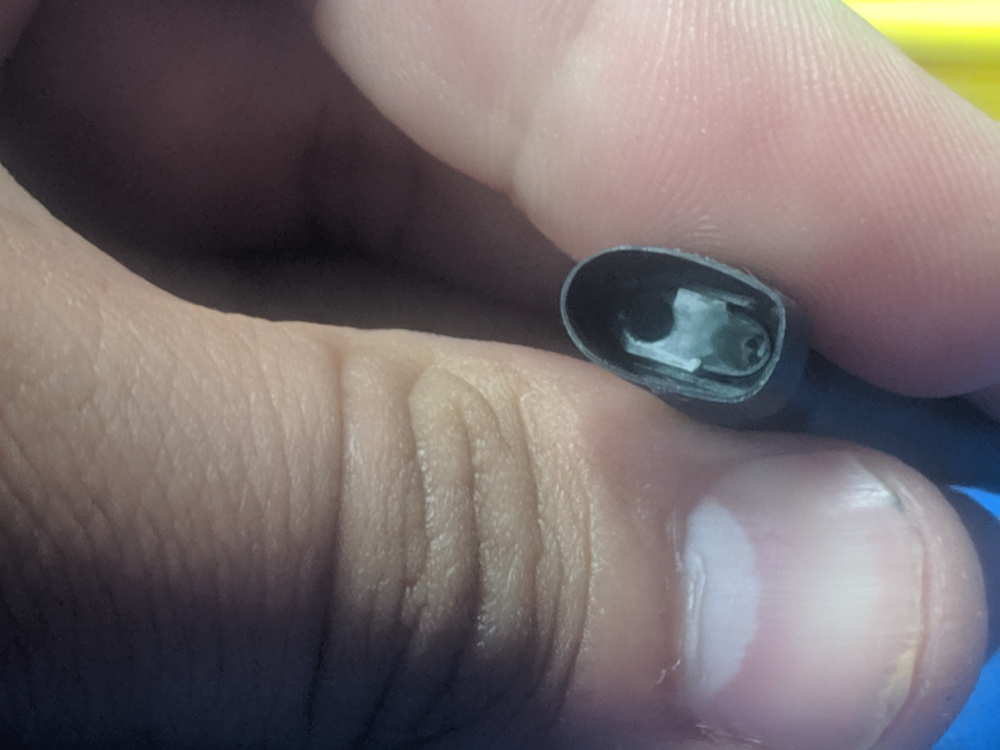
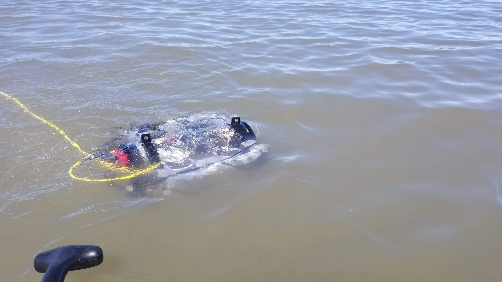
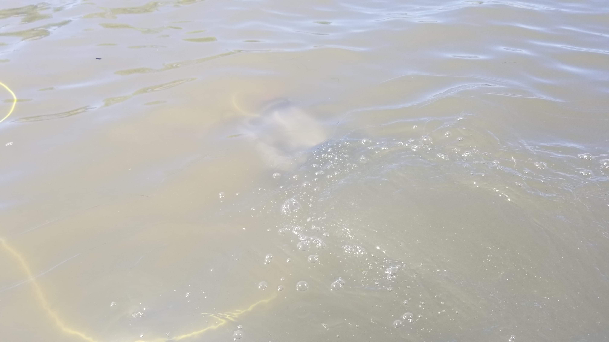
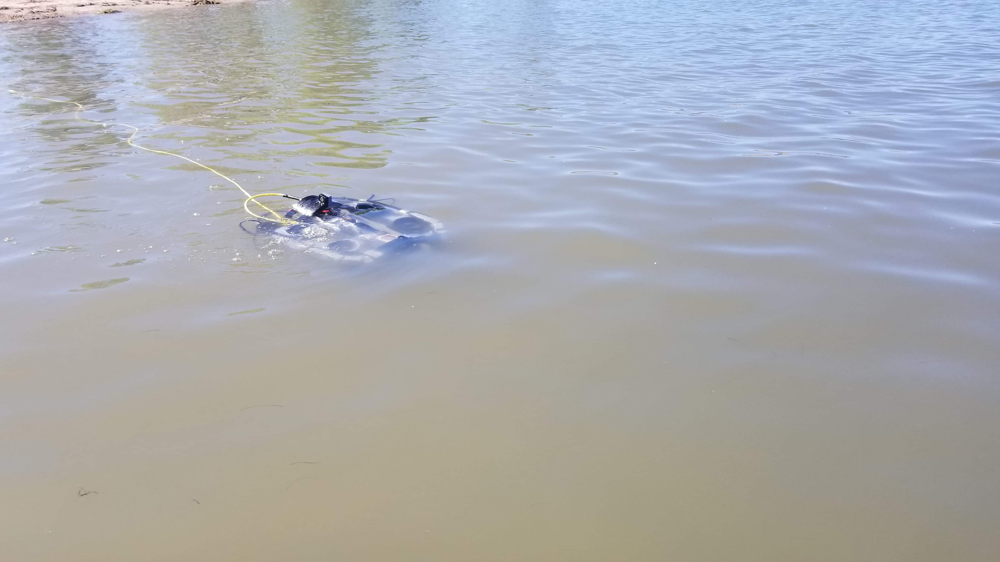

# Janus : Testing Chatfield (9/22/2019)

## Cord Repair

During packing up of Janus it was discovered that when removing the tether the night before the XT30 broke from the wires.  Inspection of the solder joints showed no corrosion from the time in the divewell.  To fix it the silicone and the heatshrink where cut away and everything was reterminated.

## Chatfield Testing

A trip to Chatfield reservoir was taken to test the submarine.  The location for testing was in the main reservoir near the marina along the plub creek road.  The visibility was only 6 inches.  

There were 2 hours for the silicone to dry during travel from the house to the lake.  The heatshink did not overlap halfway up the XT30 and was loose around the bottom.  Exposed silicone had dried and the test was continued.  The sub had a freshly charged battery and silica gel inserted and the hull was pumped down and sealed.  The tether was tied off to the frame and connected and the router powered up.  The Nano fan was started up and the motors and camera tested.  During setup the dome fogged up.  The vaccum was released and the dome removed.  It was sprayed with defog and rinsed.  The dome was reattached and the sub vaccumed again.

Video was initally attempted with the nvidia encoder with gstreamer but the laptop could not parse h265parse so it could not be used.  Bug needs to be fixed but in the meantime regular ROS streaming was used.  RQT was setup to show the video stream as well as the battery voltage and IMU Temperature.

Janus was placed in the water.  Its pitch was already well balanced so it was not adjusted.  The sub was controlled at the surface by watching it from afar.  The video feed was not useful as the visibility was only 6 inches.  It was driven up to paddle board and only at point blank distance was it discernible.

Steering the sub from afar was very diffcult as it would be sligtly below the surface at times.  This made it hard to drive in a strait line.  Yaw setpoint control as well as a yaw/heading display in RQT is recommended to correct this.  Thurster odometry fused with IMU data should allow semi accurate state estimation to use in low visibility situations.  For near surface operations like this it would also be benificial to have a brightly colored flag that sticks up a few feet above the submarine as a reference.

Pitch was still very unstable with the sub occationaly porpoising at the surface.  Definitly need to tune pitch and redistribute balast lower on the sub for more natural stability.

Depth control worked well enough to dive the submarine and surface it but it did not stabalize at setpoints.  Depth sensor was off by 0.4 meters.  Should add a zeroing functionality to run at the surface.  Ideal for it to save to a yaml and reload so it only needs to be used once at a given location like the IMU calibration.  Deepest depth was 0.8 meters down, bottomed out on the bed of the lake.

When driving the sub back to the shore it was bottomed out.  All the motors where spinning and functional.  After turning off the motors were inspected.  There was seaweed in the downward motors blades, but it did not bind up with any other parts and they could still spin.  Sand was present in all the motors and you could feel them crunching around when spun by hand.  Plan to wash the motors when getting back to clear sand.  Ideally we should avoid bottoming out to prevent sand damaging the motors.  This could be aided by using the bluerobotics ping as an altimeter.

Upon completion of battey recharging the charger reported 2518 mah entering the battery which is ~84% of its specified capacity.  Battery was dischared to 3.5v per cell which is a safe termination voltage.

## Extra Photos

## TODOs
* GUI data displays
* Depth Zero Calibration commmand
* Lower Center Of Mass
* Install gstreamer h265parser on laptop

## Remember to
* Pull the tether from the XT30 to not break the tether
* Vaccum the tube before diving to prevent poping
* Monitor battery voltages and temperatures