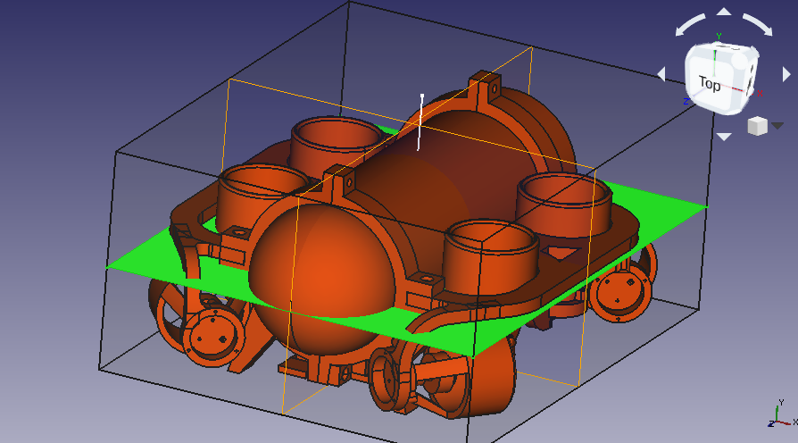

# Janus : Rebalancing and Measurements (9/25/2019)

## Scale Modifications

A hanging scale was purchased to do buoyancy measurments of Janus.  The key issue with the digital scale was one of waterproofness.  The load cell was easily removed and the 4 wires had 3 feet of extension added to them.  Care was taken to silicon insoluate the wires to prevent issues with water penetration when testing.  This allowed submerging of the loadcell while keeping the electronics as a remote display.  Tests showed out of water this was still funcional and calibrated.

|  |  |
|:---:|:---:|

A piece of Duct Tape was applied to a 2.5lb barbell weigth and the load cell was slid under it.  This was submerged and hooked to the lower bar of the submarine placed to allow the sub to float as flat as possible.  The submarine was pushed down sligtly and the load cell was zeroed.  Then the sub was released.  The measurment settled at 0.18lb and was repeated multiple times.

This setup had some issues.  If the submarine was pushed too far down when zeroing the hook from the loadcell would come off the submarine.  When trying to install the hook on the submarine if the weight was lifted it was easy for the loadcell to slip off of the duct tape.  Recommend designing a 3D Printed holder for the loadcell that can be more reliably stay attached to it and the weight.

## Rebalancing

The submarine was rebalanced to make it more passivily stable.  It previous testing it was deterimened that the sub was to prone to pitching/rolling and that its thrusters where firing to far below the center of mass causing unwanted pitching during operation.  This is partially due to ballast being applied above the frame.  It is belived this put the center of mass and center of buoyancy very close together.  A support tray that runs along the bottom of the body of the sub was designed and 3D printed to allow moving the balast from above the frame to below the sub body.  This was installed and 33 of the balast weights where duct tapped onto the tray.

The sub was placed in a bucket and its neutral buoyancy tested.  When moving the tube back and forth in the frame the reverse of the expected adjustment was observed.  It was assumbed that the shifting of the mass of the tube would have the greatest effect in changing the pitch but it was the shift in the displacment causing an opposite change in pitch than what was expected.  To achive neutraly stable pitch the tube was pushed as far back in the frame as possible, with the dome ring incontact with the frame clamp.  Should try to adjust the balast so we can have the frameclamps in a more neutral position.

## Center of Mass Measurement

To measure the center of mass of the submarine it was suspended from the top of its front and rear frame clamps.  The intersection of the gravity vectors in each case was taken to estimate the center of mass.  The result was a sport inbetween the center motor mounts, 4cm below the frame line.  This is very close to being inline with the thrusters which should reducing the pitching when driving issue significantly.

During the initaly measurment a 1/2 wide piece of duct tape was used as the hanging cord.  This tore and the submarine fell.  In the sucessfull tests a full width piece of tape was used and there where no issues.  It was hung from a shelving rack and the rack frame was used as a gravity vector reference.  Photos where taken and overlaied to find the intersection point.

The submarine was mostly caught but took significant damage in the fall.  Both of the top bolt points on the frame clamps cracked.  The side of the frame that hit first took significant damage.  The front and rear motor mounts broke off.  The frame broke at the rear weld point.  The rear thruster cowling broke at the supports.  The front motor mount shatered at all of the holes and more spots into 6-7 pieces.  All pieces where found and acetone welded back together.  The frame appears to be functional again.

## Center of Buoyancy Estimation

### Estimation from 3D Model

The center of buoyancy can be calculated from the center of mass of a constant density equivalent of the volume displaced by the submarine.  Looking at the model it appears the majority of non-tube displacment occurs below the frame line, so the COB should be below the frame line.

Measurments from freecad show it being forward of the cenerline as well as about 1cm below the frame line.

### Estimation from Applied Force

When applying force to the sub there are 3 forces acting.  The downward applied force, the bouyant force at the COB, and the force of gravity at the COM.  The sub must orient itself in such a way as for these 3 forces and there applied torques to cancel out.

Sub was allowed to float in center of bucket.  Downwards force was applied to the center of one of the sides of the frame.  The sub became slightly submered and floated at a slight angle.  The line parallel to the horizon intersected approximately with the center of the battery.  Without measruing the downward applied force I do not thing it is possible to compute the COB from this data.

## Simulation Results

A new volume was calculated using the known weight and buoyancy.  The sub had no problem holding depth and was fairly pitch/roll stable in the simulator.  It seemed a bit to quick so its dampening coefficents are probably to low.

We can measure the coefficents my measuring the required force/torque to move/rotate the submarine at constant rates in the water.  This may be difficult to achive.  We would need to do a tow test.  Spining the sub about its COM may create futher complications.

Alternativly we can attempt flow simulations to find the force applied by different flow velocities.  This may require the model to be pulled into solidworks or other similar commercial software.

## Future Work

Read a paper on AUV modeling: https://www.ensta-bretagne.fr/clement/pdf/ICARS14.pdf

Its description of added mass cleared up a few things for me.  Added mass is effectivly the extra inertia from the fluid around the submarine.  The fluid is pulled around due to viscosity etc. and needs to be accounted for during accelerations.

Added mass was calculated with WAMIT and MMC.  Need to investigate the availability of use of these tools.  If they are able to be used freely an attempt at calculating the added mass will occur.  Off diagonal components may have to be ignored as is seems they are negligiable as well as potentially in accurate.  Tow tests should be able to verify these to some degree as well.  Recording the force during linear accelerations and subtracting out the dampening should allow for computation of the added mass.

In steady state velocities the dampening terms are what need to be considered.  ROS & Gazebo use units of newtons for force and meters per second for velocity.  These should be the units for the linar & quadratic dampening terms.  These terms are for a quadratic equation that computes the drag force in newtons based on the velocity in meters per second.  In general only the matrix diagonal is used in models for uuvsim.  I am not sure how to compute the non-diagonal elements but assume it would require data from motions along cross diagonal vectors that account for the drag in that direction while not affecting the pricipal axis results.

Fluid simulations in each of the pricipal axis should give dampening terms.  From the paper it is expected that the quadratic term will be dominant.  Simulations can be verified with two methods.  We could measure the static force from the motors and then time the sub moving a certain distance to see what its speed with a given force is.  This should line up with the results from the dampening.  This may have issues as we may not have the same thrust moving as stationary.  As an alternative tow tests could be performed with a load cell in the towline giving the drag force at different speeds.

## Measurments used in Weight Tray Design

Frame

* 239.45mm Front to Back Same Edge
* 219.45mm Inner to Inner
* 20.00mm Bar width
* 10.00mm Bar height

Frame Clamp

* 20.00mm Width
* 15.63mm Height
* 1.16mm Tapper to top
* 8.00mm Bottom Thickness
* 2.50mm Screw Radius
* 74.50mm Hole Offset
* 82.15mm Bottom Offset
* 139.70mm Tray Length
* 79.75mm Support Bar Length
* 5.00mm Tray Thickness