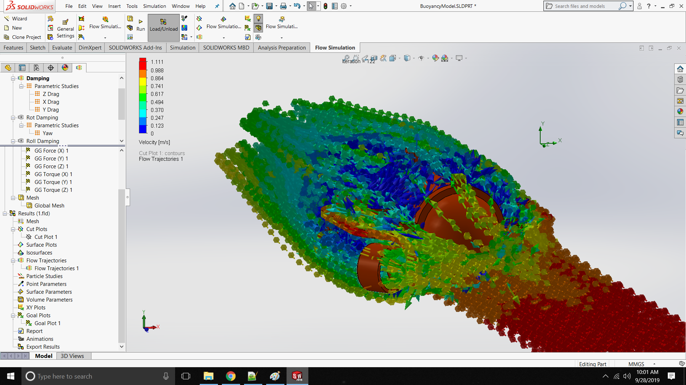

# Janus : Flow Simulation (9/26/2019)

## Simulation Model

To create a model for buoyancy calculation and flow simulation the central tube needed to be a single solid.  This was modeled as a cylinder with a half sphere on the end.  Then it was attached to the frame resulting in a equivilant shape & volume model.  To compute the Center of Buoyancy the Center of Mass macro was used.  It was about 1 cm below the frame line and about 2-3cm forward of the center line.
This model was exported from FreeCAD as a STEP file and reimported into solidworks for flow simulation.  Solidworks did not like the zero volume intersections of the motor mounts so some modification where required.  The model was split back into its original assembly components and the motors where all moved 1mm into their mounts.  Then all the parts where recombined into a single body.  Now the flow volume could be recognized.

## Flow Simulation Setup

For the flow simulation an external flow simulation with water was used.  For translational components the global flow velocity was measured.  Global goals for torque and force where recorded.  What if scenarios were set up for each of the principal axis to measure the global force on that axis from -1m/s to 1m/s with 0.1m/s intervals.  For the rotational components a Local (Sliding) rotational frame was used.  A cylinder was created slightly larger than the sub in each axis to use as the rotating region.  A what if scenario was set up changing the angular speed of the rotating region from -6.28 rad/s to 6.28 rad/s in 0.785 rad/s increments.  The results where only slightly asymetic (less than 10% difference) and the larger values where used.  A quadratic regression was done on each of the results to generate quadraic and linear damping coefficents.

## Motor Measurment

To estimate the motors true max thrust a piece of duct tape was wrapped around the center of the sub body.  Additional tape was used to wrap around the extension upward to keep it strait.  A hole was cut in the end to use with a hanging scale.  The sub was put in a bucket and the downmotors run at full power and the downforce measured with a hanging scale.  The individual motor force was estimated to be 1/4 of the total force.

During motor testing the power relay failed.  It would click over and you would see the Fathom LED light up briefly.  It appears to be caused by contact corrosion from the dunk in the water.  The contacts where visibly black and after cutting open the relay the contact resistance was measured.  Values of 0.5 ohm, 3 ohm and open were seen.  The relay had to be desoldered and replaced before the motor test could be done.  Hopefully without water damage this relay will last longer.  If the damage was from normal use a soft start circuit may need to be implemeneted.

## Gazebo Model

The results of the flow simulations and the measured motor force were put into the Gazebo hydrodynamic model.  The translational components where slightly smaller than what had been initaly estimated.  The rotational components where several orders of magnitude smaller.  With the new components in simulation the vehicle control felt much more like real world.  The yaw was very sensitive.  It was noted that the vehicle would spin in yaw for a considerable amount of time.  I believe the forward thrust stabilizes the yaw somewhat.  May need to look at the off diagonal components to see if forward motion adds yaw damping/restoring force.

## Video Analysis of Yaw

Due to the extreme nature of the yaw damping and the seemingly odd behaviour of rotating for extend periods without thrust imput a experiment was done to validate the simulation behaviour.  The sub was placed in the bucket and spun by hand on the yaw axis and its rotation recorded.  The sub made multiple revolutions and continued to spin for a considerable amount of time.

To validate this emperically a screen recording of the simulated sub was taken as well.  Both videos where pulled into Tracker video analysis software to extract the rotation of the submarine.  When the results where plotted they matched fairly well.  Visually the behaviour appeared to be similar.  The real sub seemed to spin longer at the lower speed.  This could be do to an incorrect linear component in the damping or the lack of any current added mass in the model.

# Appendix A: Flow Trajectories

